# Monitoring MongoDB and EC2 VMs for a Kubernetes-Connected Application (Golang) on AWS #

## Project Overview ##

This project implements a monitoring solution for a MongoDB database used by an application running in a Kubernetes cluster on AWS. Although the application is Kubernetes-connected, the monitoring scope of this project is limited to the MongoDB database and the EC2 virtual machines supporting the monitoring stack.

The setup includes:

- **MongoDB Exporter** to monitor MongoDB database metrics

* **Node Exporter** on the MongoDB EC2 instance to monitor VM metrics

* **Node Exporter** on the monitoring EC2 instance to monitor Prometheus/Grafana host metrics

* **Prometheus** to scrape metrics

* **Grafana** to visualize metrics

* **Terraform** to provision infrastructure

The MongoDB server is hosted on an EC2 instance in a private subnet, while the monitoring stack is hosted on an EC2 instance in a public subnet. Prometheus scrapes exporter endpoints over private VPC networking, ensuring that the MongoDB instance is not publicly exposed

## Project Scope ##

This project monitors the following:

- MongoDB database metrics
- MongoDB EC2 VM system metrics
- Prometheus/Grafana EC2 VM system metrics

This project does not monitor:

- Kubernetes cluster metrics
- Kubernetes nodes
- pods or containers
- application-level metrics inside Kubernetes

Kubernetes is included in this project only because the application connects to MongoDB.

## Project Architectural Diagram ##

This diagram provides a high‑level overview of the infrastructure, showing how the Kubernetes cluster, MongoDB instance, and monitoring stack interact across the public and private subnets.

## Architectural Summary ##

#### Components ####

#### 1. Private Subnet:

- MongoDB EC2 instance

- MongoDB

- MongoDB Exporter

- Node Exporter

#### 2. Public Subnet:

- Monitoring EC2 instance

-   Prometheus

-   Grafana

-   Node Exporter

-   Kubernetes Environment

-   Application deployed in Kubernetes

-   Application connects to MongoDB

Kubernetes is not directly monitored in this project.

## Project Objectives ##

The objectives of this project were to:

-   Provision AWS infrastructure using Terraform
-   Deploy MongoDB securely in a private subnet
-   Expose MongoDB metrics using MongoDB Exporter
-   Expose EC2 Virtual Machine metrics using Node Exporter
-   Allow Prometheus to scrape private targets over the VPC
-   Visualize metrics in Grafana
-   Validate service health and monitoring connectivity

## Technology Stack ##

| Category                     | Technology           |
|------------------------------|----------------------|
| **Cloud Provider**           | AWS                  |
| **Infrastructure as Code**   | Terraform            |
| **Database**                 | MongoDB              |
| **Monitoring**               | Prometheus           |
| **Visualization**            | Grafana              |
| **System Metrics Exporter**  | Node Exporter        |
| **Database Metrics Exporter**| MongoDB Exporter     |
| **Container Platform**       | Kubernetes           |
| **Operating System**         | Ubuntu 22.04         |
| **Other Dependencies**       | AWS CLI              |
| **Other Dependencies**       | AWS Credentials      |

## AWS Infrastructure ##
### Provisioned Resource ###

* VPC: 1

* Public subnet: 2 

* Private subnet: 2

* Internet Gateway: 1

* NAT Gateway: 2

* Route tables: 

* Security groups: 

* Monitoring EC2 instance: 1

* MongoDB EC2 instance: 1

* Key pair / access method: SSH key / SSM / 

## Terraform Configuration ##

### Respository/Folder Structure ###

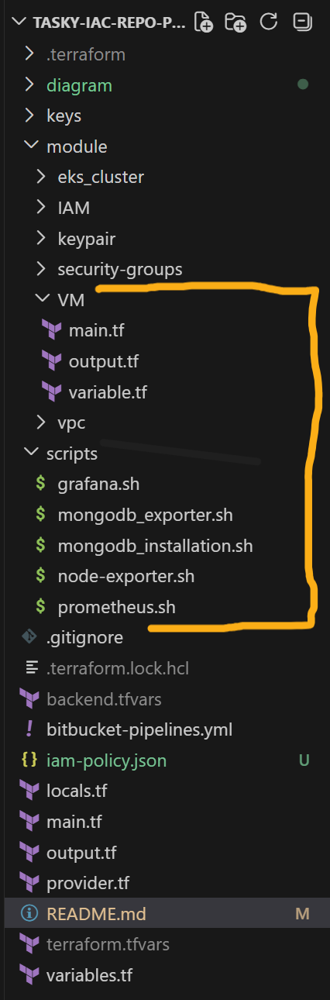

## Important Ports ##

| Service          | Port            | Hosted On                        |
|------------------|-----------------|----------------------------------|
| MongoDB          | 27017           |      MongoDB EC2                 |
| Node Exporter    | 9100            |      MongoDB EC2                 |
| MongoDB Exporter | 9216            |      MongoDB EC2                 |
| Grafana          | 3000            |      Monitoring EC2              |
| Node Exporter    | 9100            |      Monitoring EC2              |
| MongoDB Exporter | 9100            |      Monitoring EC2              |

## Terraform Command ##

After completing the Terraform Configuration (ensure you output some important resource ids) run the following command:

* terraform init
terraform validate
terraform plan
terraform apply -auto-approve

## Monitoring EC2 VM Configuration and Status Check on Command Line ##

* SSH into the Monitoring VM (using the monitoring vm public_ip output)

        ssh -i <keypair> ubuntu@<instance_public_ip>
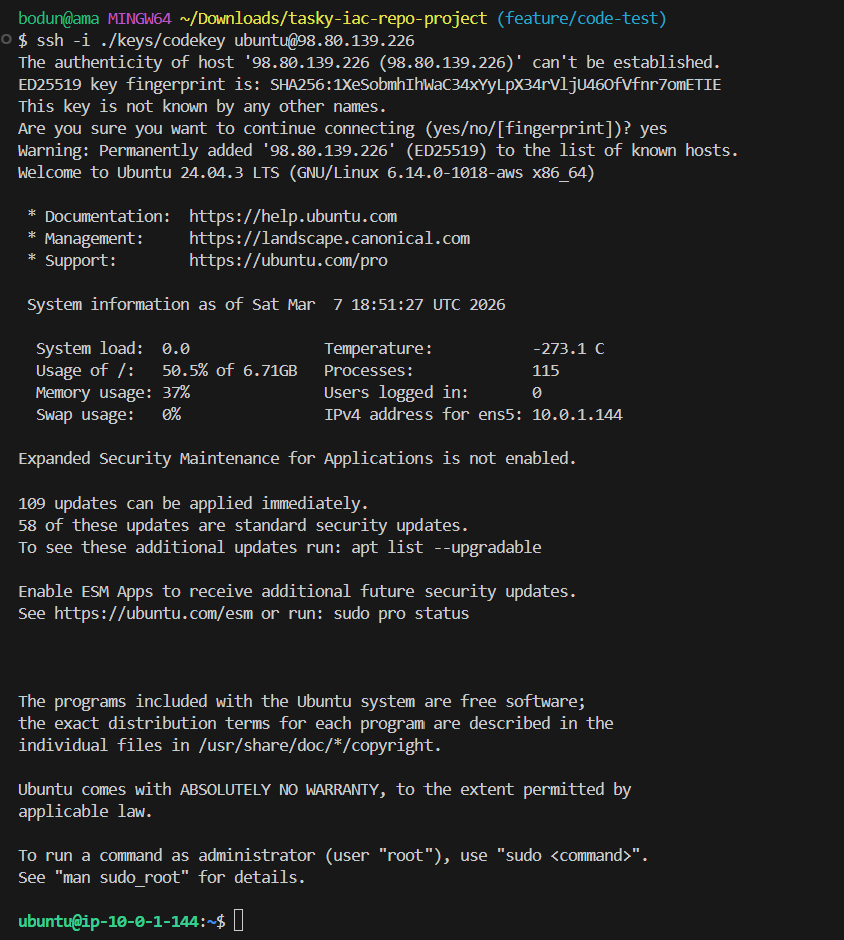

* Confirm the Prometheus binary is installed

        prometheus --version
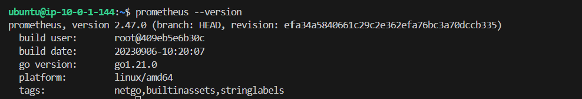

* Check the Prometheus systemd service status

        sudo systemctl status prometheus
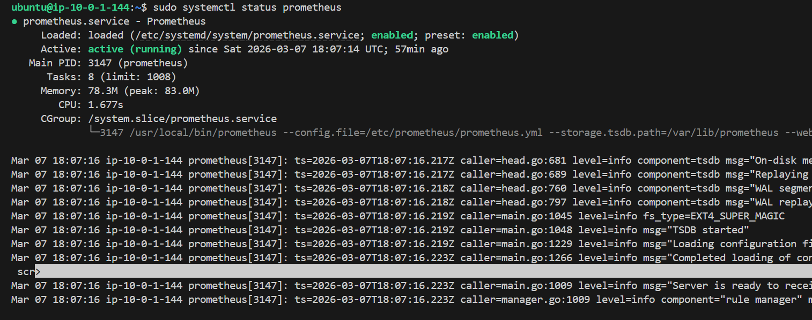

*  Check the Grafana systemd service status

       sudo systemctl status grafana-server

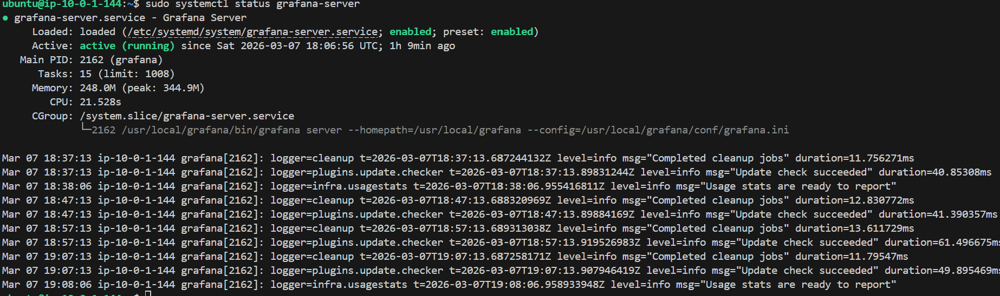

*  Check the Node Exporter systemd service status

       sudo systemctl status node_exporter

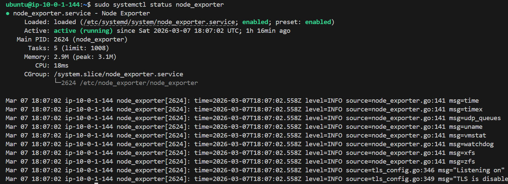

*  Verify Prometheus, Grafana and Node Exporter are listening on ports specified

   
        sudo ss -tulnp | grep 9090    - Prometheus
        sudo ss -tulnp | grep 3000    - Grafana
        sudo ss -tulnp | grep 9100    - Node Exporter
      

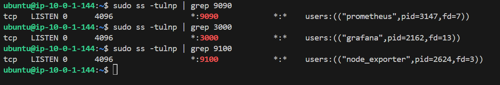

*  Test Node Exporter metrics endpoint 

        curl http://localhost:9100/metrics

A long list of metrics confirms Node Exporter is running correctly  

.
## Test Connectivity From Prometheus VM → Private VM ##

Prometheus must be able to reach the exporters over the network and must be scraping them successfully. You validate this in three layers

Node Exporter (port 9100)

    curl http://<private-vm-ip>:9100/metrics
.

MongoDB Exporter (port 9216 or 17001 depending on your setup)

    curl http://<private-vm-ip>:9216/metrics

If you see a long list of metrics, network connectivity is good and the exporters are running

## Updating the Prometheus scrap_configs YAML to use as scrape ##

Edit the prometheus scrap_confiqs Yaml

    sudo vi /etc/prometheus/prometheus.yml

    sudo sh -c '> /etc/prometheus/prometheus.yml' |Use this first if you want to clear the scrap configs and write new one|

Update the YAML file with the IP of the targeted resource (Monitoring VM-localhost and Database VM )

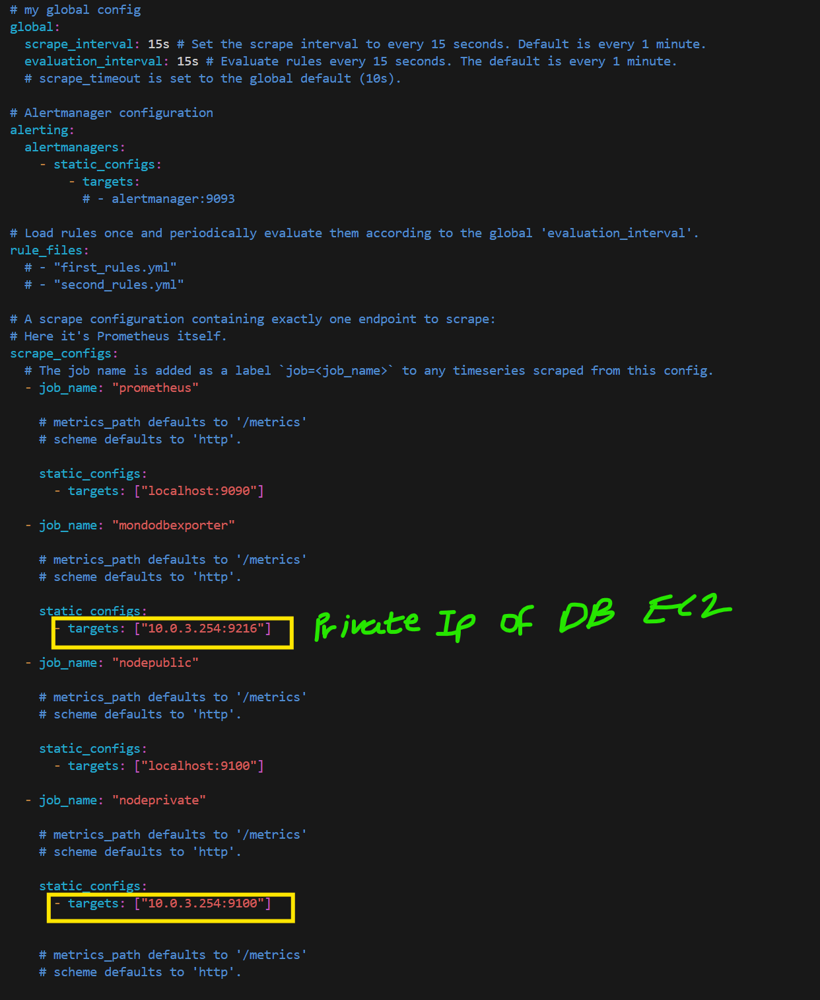

Validate the entire Prometheus configuration file

    promtool check config /etc/prometheus/prometheus.yml

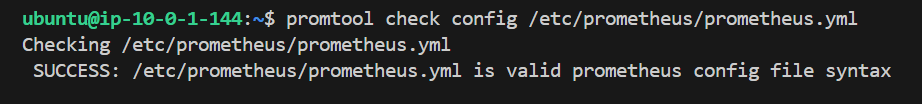

Restart Prometheus

-   After completeting the above, run the command below to restart prometheus:

        sudo systemctl restart prometheus

- Check Prometheus Status

        sudo systemctl status prometheus

- A healthy output should show

        Active:active(runnig)
        No YAML parsing errors
        No failed to laod config" messages
     

## Accessing the Prometheus UI ##

- Open the Prometheus UI in your browser

        http://<MONITORING VM-PUBLIC-IP>:9090

.

- Navigate to the Promethus UI

        Click Status in the top navigation bar

        Click Targets

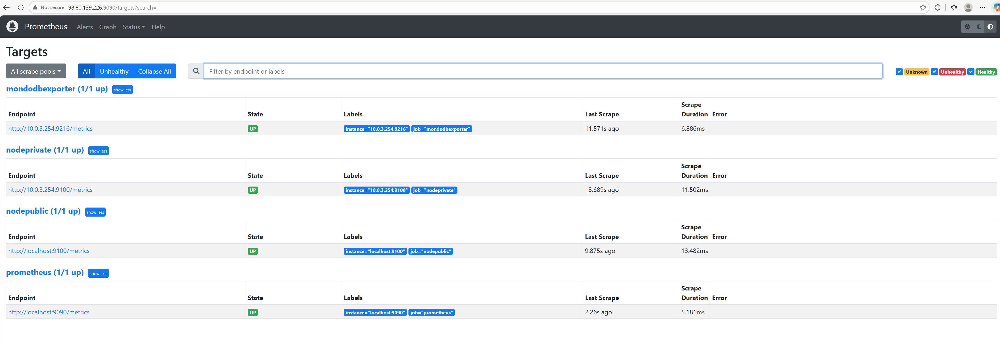

        
  
## Logging Into Grafana ##

Grafana runs on port 3000, and you can access it through your browser using the public IP of the Monitoring VM.

- Open Grafana in your browser

        http://<MONITORING VM-PUBLIC-IP>:3030

.

- Default Grafana Login Credentials

    If you have not changed the defaults:

         Username: admin
         Password: admin

    Grafana will immediately prompt you to set a new password after the first login

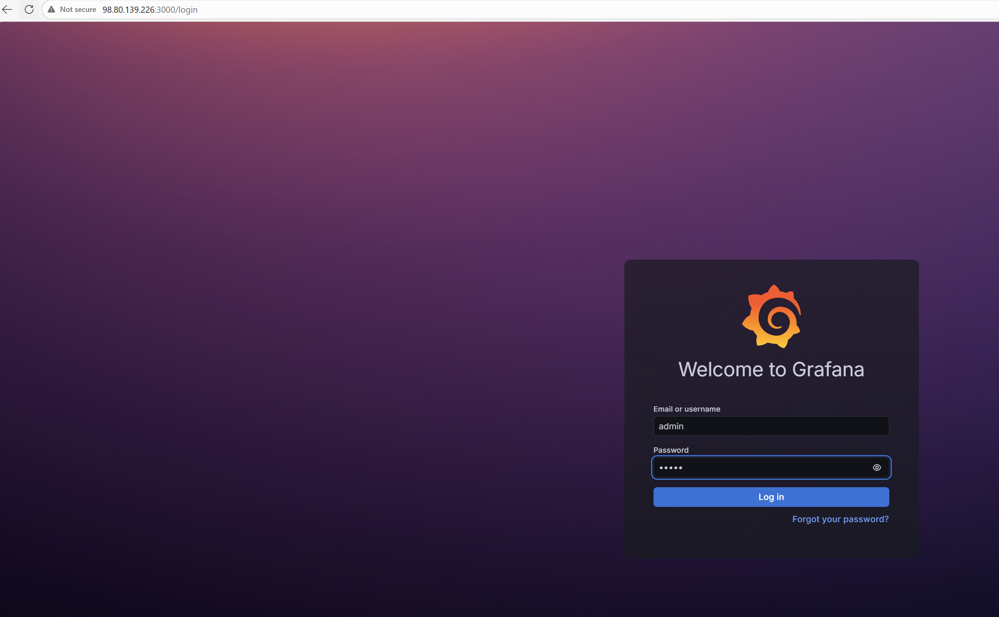

- Grafana Home Page

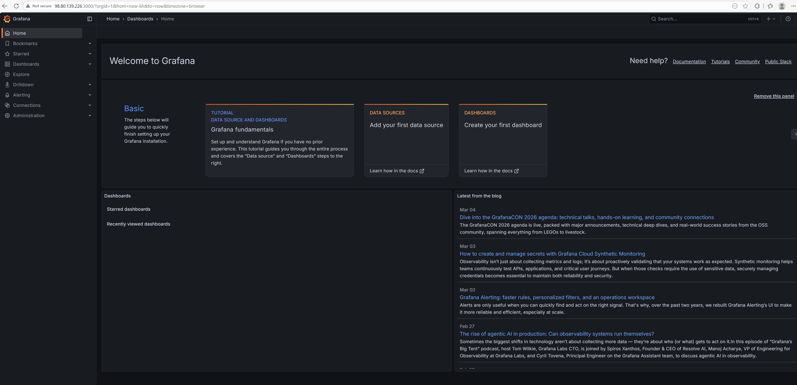

## Set Up Grafana Dashboard ##

From the Grafana Home Page

- Click Data Source, add a data source (Prometheus)

- Add Prometheus as a Data Source (This is the first thing you must do so Grafana can read your metrics)

    -   Click Connections (left menu)
    -   Click Data sources
    -   Click Add data source
    -   Select Prometheus
- In the URL field, enter

        http://<PROMETHEUS-PRIVATE-IP>:9090

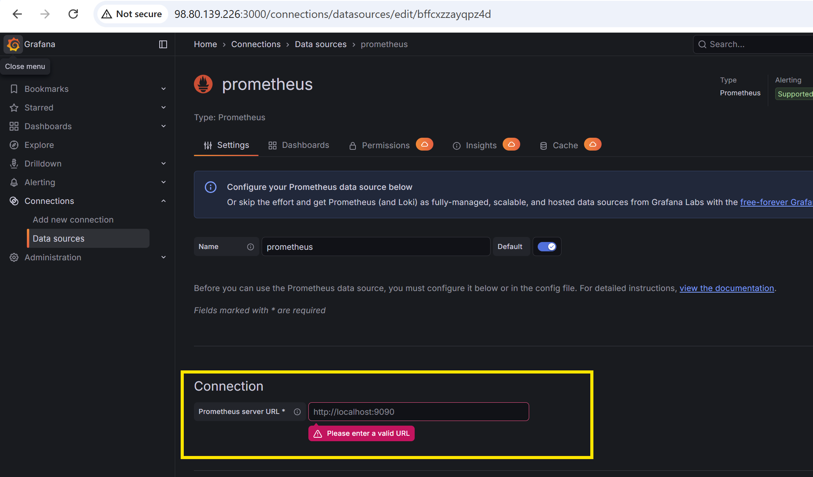

- Scroll down and click Save & Test
    - You should see "Successfully queried the Prometheus API"

## Import Dashboards ##

Grafana has prebuilt dashboards for:

- 	Node Exporter
-	MongoDB Exporter
-	EC2 system metrics
-	Prometheus internal metrics

---

#### Virtual Machine(VM) Dashboard ####

To import:

-   Click Dashboards (left menu)
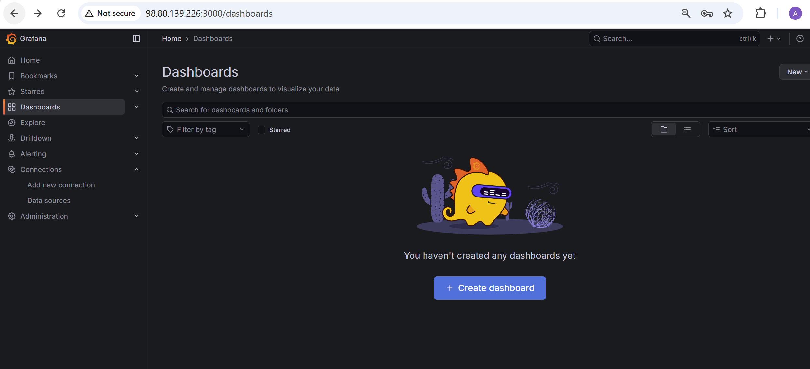

- 	Click Import
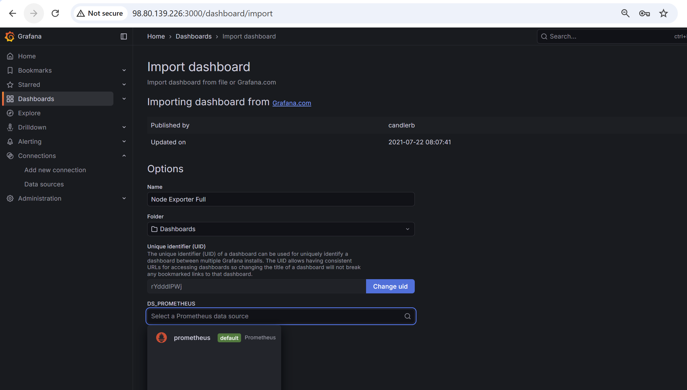

- 	Go to https://grafana.com/grafana/dashboards/?search=prometheus+node. Select the dahbaord from Grafana.com

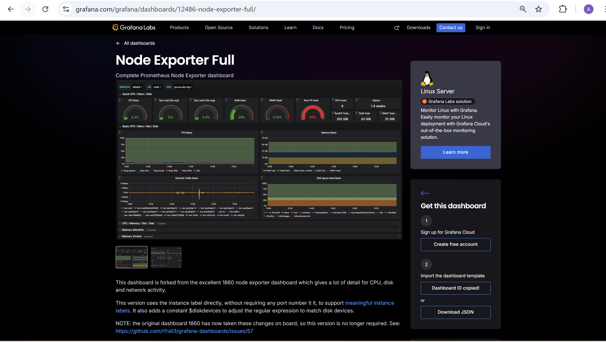

-   Copy Dashboard ID and click load

-	Select your Prometheus data source

- Click Import (Your dashboard will appear immediately).

    - Metric of VM in Public Subnet(Monitoring VM)
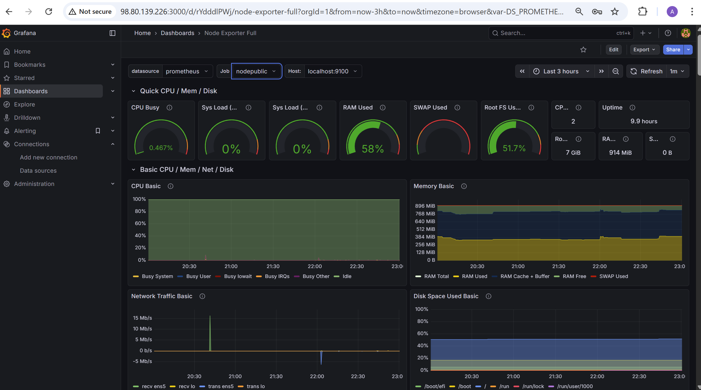

    - Metrics of VM in Private Subnet (Database VM)
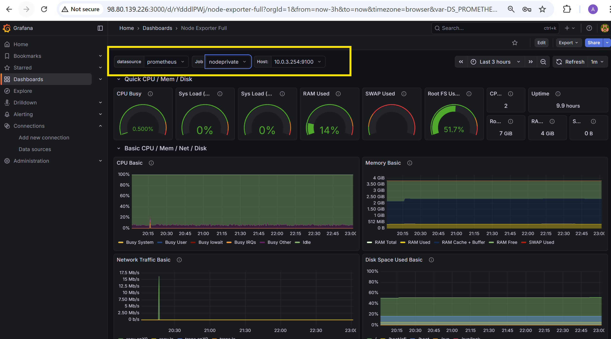

#### Database Dashboard ####

Repeat the same steps as above

-   MongoDB Dashboard
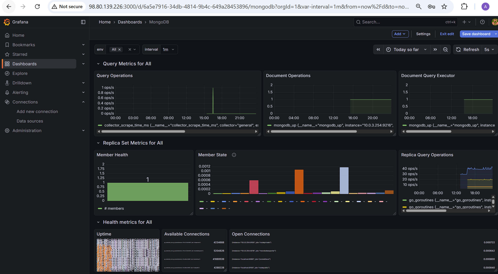