# Tasky Application CI/CD Pipeline with EKS Deployment

## Project Overview

This Bitbucket Pipelines configuration automates the **complete software delivery lifecycle** for the Tasky application on AWS EKS, including:

- **Security Scanning**: Automatic vulnerability and secret detection on all code changes

- **Container Build & Push**: Docker image creation and push to Amazon ECR

- **Kubernetes Deployment**: Automated deployment to EKS with rolling updates

- **Database Management**: Backup and restore operations for MongoDB using AWS SSM

- **Monitoring Deployment**: Prometheus stack deployment via Helm for cluster observability

- **Operational Tasks**: Rollback, secret updates, and application destruction

The pipeline ensures **secure, repeatable, and auditable** deployments following GitOps best practices.

## Pipeline Architecture


---

## Pipeline Stages and Triggers

### Automatic Triggers

| Trigger | Executed Steps | Purpose |
|---------|---------------|---------|
| **Pull Request** (any branch) | Trivy Scan → Gitleaks Scan | Security validation before merge |
| **Git Tag** (v*) | Trivy → Gitleaks → Build & Push → Deploy | Production release deployment |

### Manual Triggers (Custom Pipelines)

| Pipeline Name | Steps | Use Case |
|---------------|-------|----------|
| `update-apllication-secret` | Update secret → Restart deployment | Rotate database credentials |
| `Destroy-application` | Delete service, deployment, secret, namespace | Full application cleanup |
| `rollback-deployment` | Rollback to previous revision | Recover from failed deployment |
| `Deploy-k8s-monitoring` | Deploy Prometheus stack | Install cluster observability |
| `db_backup` | MongoDB dump → Sync to S3 | Scheduled database backups |
| `db_restore` | S3 sync → Mongorestore | Disaster recovery |

## Pipeline Components

### 1. Security Scanning

#### Trivy Scan
```
- Scanners: vulnerabilities (vuln) + secrets (secret)
- Severity threshold: HIGH, CRITICAL
- Exit code 1 on finding (blocks pipeline)
```

**What it detects**:

- OS package vulnerabilities (CVEs)

- Application dependency vulnerabilities

- Hardcoded secrets, API keys, tokens

- Misconfigurations

#### Gitleaks Scan
```
- No git history required (--no-git)
- Redacts findings (--redact)
- Verbose output (--verbose)
- Exit code 1 on finding (blocks pipeline)
```

**What it detects**:

- AWS access keys

- Private keys (SSH, PGP)

- API tokens (Slack, GitHub, etc.)

- Database connection strings

### 2. Build and Push to ECR

**Step**: Build_and_push_image

**Process**:

- Authenticate Docker to AWS ECR

- Build Docker image with version tag from BITBUCKET_TAG

- Tag image for ECR repository

- Push to Amazon ECR

**Prerequisites**:
```
- AWS_ACCOUNT_ID (repository variable)
- AWS_REGION (repository variable)
- AWS_ECR_REPOSITORY_NAME (repository variable)
- BITBUCKET_TAG (provided by Bitbucket on tag push)
```

**Docker Build Arguments**:

*APP_VERSION=${BITBUCKET_TAG}* - Version label for the application

### 3. Kubernetes Deployment

**Step**: Deploy-application

**Deployment Order**:
```
1. Configure kubectl for EKS cluster
2. Deploy cluster-autoscaler (RBAC + Deployment)
3. Create production namespace
4. Retrieve MongoDB credentials from AWS Secrets Manager
5. Create Kubernetes secret (mongodb-user)
6. Deploy application deployment.yaml
7. Deploy service.yaml
8. Wait for rollout completion
9. Update deployment image with new tag
10. Annotate deployment with change-cause
```

**Kubernetes Resources Deployed**:

| Resource	| Name	| Namespace |
|-----------|-------|-----------|
|Namespace	| production	| -
| Secret	| mongodb-user	| production
| Deployment	| tasky-deployment	| production
| Service	| tasky	| production
|ClusterAutoscaler	| cluster-autoscaler	| kube-system

**Environment Variables Substituted**:
```
${CLUSTER_NAME}          - EKS cluster name
${AWS_REGION}            - AWS region
${SECRET_REPOSITORY_NAME} - Secrets Manager secret ID
${USERNAME}              - MongoDB username
${PASSWORD}              - MongoDB password
${MONGODB_PRIVATE_IP}    - MongoDB VM private IP
${AWS_ACCOUNT_ID}        - AWS account ID
${AWS_ECR_REPOSITORY_NAME} - ECR repository name
${BITBUCKET_TAG}         - Bitbucket_tag
```

### 4. Database Backup & Restore

**Backup Process** *(db_backup)*
```
1. Retrieve MongoDB credentials from Secrets Manager
2. Send SSM command to MongoDB EC2 instance
3. Execute mongodump to /tmp/db-backup
4. Sync backup folder to S3 bucket
5. Wait for command completion
6. Display command output
```
**SSM Command**:
```
sudo mongodump \
  --db go-mongodb \
  --uri=mongodb://${USERNAME}:${PASSWORD}@${MONGODB_PRIVATE_IP}:27017/go-mongodb?authSource=admin \
  --out /tmp/db-backup
```

**Restore Process** *(db_restore)*
```
1. Retrieve MongoDB credentials from Secrets Manager
2. Send SSM command to MongoDB EC2 instance
3. Sync S3 bucket to /tmp/db-restore
4. Execute mongorestore
5. Restart application deployment to pick up restored data
```

**SSM Command**:
```
sudo mongorestore \
  --uri=mongodb://${USERNAME}:${PASSWORD}@${MONGODB_PRIVATE_IP}:27017/?authSource=admin \
  /tmp/db-restore
```

### 5. Cluster Autoscaler

**Deployment Configuration**:

- **RBAC**: Service account + ClusterRole + ClusterRoleBinding

- **Namespace**: kube-system

- **IAM Role**: OIDC-authenticated (from Terraform module)

- **Wait**: 180s for rollout completion

- **Pod readiness check**: 60s timeout

- **Purpose**: Automatically adjusts EKS node group size based on pending pods.

### 6. Kubernetes Monitoring Stack

**Step**: kubernetes-monitoring-deployment

**Components** (via kube-prometheus-stack Helm chart):

- Prometheus Server (metrics collection)

- Grafana Dashboards (visualization)

- Alertmanager (alert routing)

- Node Exporter (node metrics)

- Kube State Metrics (K8s object metrics)

---

The application deployment process was executed in two phases:

1️. Manual Deployment (for validation & testing)  
2️. Automated Deployment using Bitbucket CI/CD Pipeline  

This approach ensured the infrastructure and application were fully validated before automation was introduced.

# Phase 1 – Manual Deployment (Running with Docker)

A Dockerfile has been provided to run this application. The default port exposed is 8080.

1. Build the application image:
```bash
docker build -t tasky:latest .
```

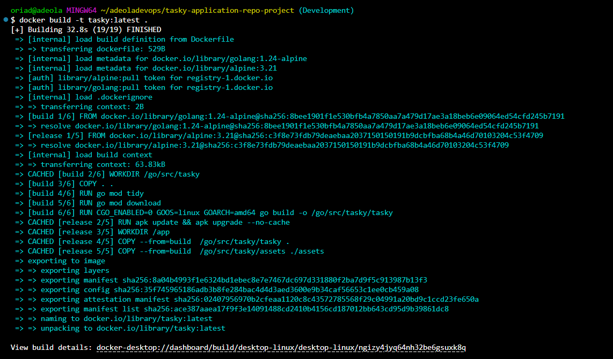

2. Check the image
```BASH
docker images
```

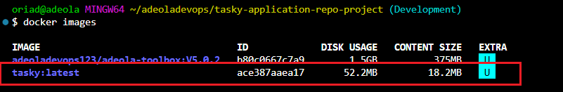

3. Authentical Docker to push image to AWS ECR register 

```BASH
aws ecr get-login-password --region ${AWS_REGION} | docker login --username AWS --password-stdin ${AWS_ACCOUNT_ID}.dkr.ecr.${AWS_REGION}.amazonaws.com 
```

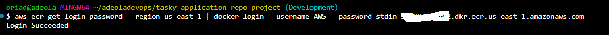

4. Tag the image: 

```BASH
docker tag ${IMAGE_ID} ${AWS_ACCOUNT_ID}.dkr.ecr.${AWS_REGION}.amazonaws.com/${MY_REPOSITORY}:${TAG_NAME}
```

5. create repository in AWS_ECR

6. Push the image to ECR 

```BASH
docker push ${AWS_ACCOUNT_ID}.dkr.ecr.${AWS_REGION}.amazonaws.com/${MY_REPOSITORY}:${TAG_NAME}
```

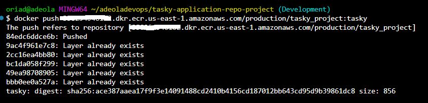

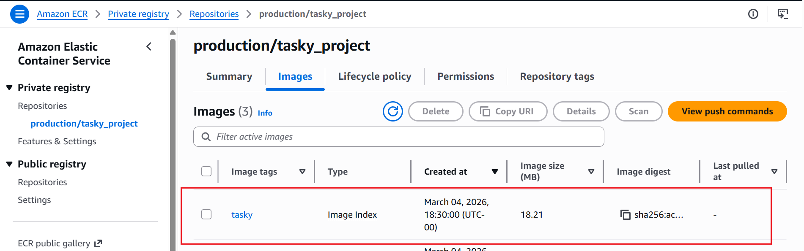
---

# Confirm Manifests files are good using kubeconform 

**Run:** 
- Kubeconform Namespace.yaml 
- Kubeconform Secret.yaml 
- Kubeconform Deployment.yaml 
- Kubeconform Service.yaml 

if it returns nothing:
    That is Good. 

## To see confirmation
**Run:**
- Kubeconform -summary Namespace.yaml
- Kubeconform -summary Secret.yaml 
- Kubeconform -summary Deployment.yaml 
- Kubeconform -summary Service.yaml 

## To validate all folder at once, run this inside the kubernetes folder

- kubeconform -summary *.yaml 

OR 

- kubeconform -summary *.yaml 

## For Strict Validation  
**Run:**
- kubeconform -strict -summary *.yml 

OR

- kubeconform -strict -summary *.yaml 

This catches more issues. 

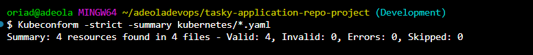
---

# Kubernetes Deployment

The application is deployed to Amazon EKS.

## Required Kubernetes Resources
- Namespace: production
- Secret (MongoDB URI)
- Deployment
- Service (LoadBalancer)

## Check image Exists in ECR 
```BASH
aws ecr describe-repositories 
aws ecr list-images --repository-name <repository-name> 
```

## Configure kubectl Access
```
aws eks update-kubeconfig \
  --name <your-cluster-name> \
  --region <your-region>
```

## Deployment
```YAML
kubectl apply -f namespace.yaml
```

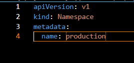

```YAML
kubectl apply -f secret.yaml
```

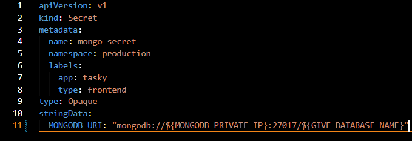

```
kubectl apply -f deployment.yaml
```

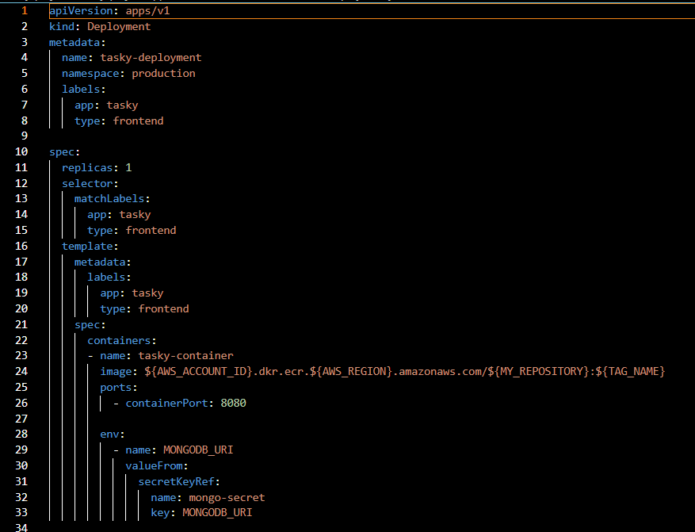

```
kubectl apply -f service.yaml
```

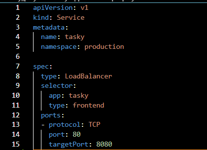


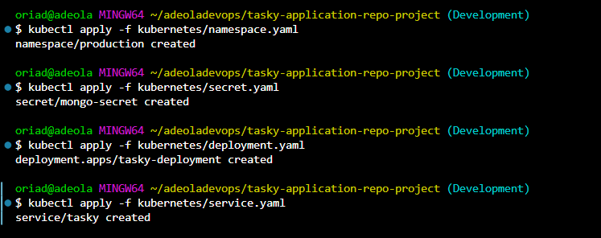

## Check applicationis work

```BASH
kubectl get namespaces
```

**Check pods:**
- kubectl get pods -n NAMESPACE-NAME

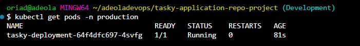

**Check service:**
- kubectl get svc -n NAMESPACE-NAME

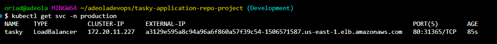

## To troubleshoot:

```
kubectl get pods –w 
kubectl describe pod <pod-name> 
kubectl logs <pod-name> 
kubectl logs -n <Name-space> <POD-NAME> 
kubectl describe pod <pod-name> -n <namespace>
```


## Accessing the Application

Since the service type is **LoadBalancer**, AWS provisions an external ELB.

**Get external IP:**
- kubectl get svc -n NAMESPACE-NAME


**Open in browser:**
- http://EXTERNAL-IP

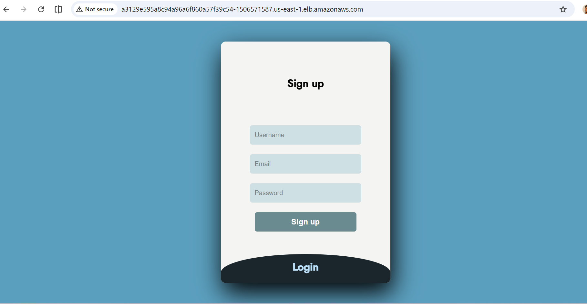

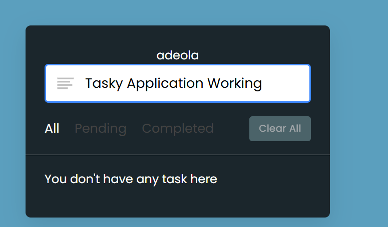

## Testing Application

- Open application in browser
- Sign-up and Log-in
- Create a new todo
- Refresh page
- Confirm data persists
- If data persists → MongoDB connection is working.

## To clean up:
```bash
docker rm -f tasky mongo-test
docker rmi tasky:latest
kubectl delete svc -n <NAMESPACE-NAME> <SERVICE-NAME>
kubectl delete deployment -n <NAMESPACE-NAME> <DEPLOYMENT-NAME>
kubectl delete secret -n <NAMESPACE-NAME> <SECRET-NAME>
kubectl delete -n <NAMESPACE-NAME>
```
---

# Phase 2 – Bitbucket CI/CD Automation

After successful manual validation, the deployment process was fully automated using Bitbucket Pipelines.

**The pipeline performs:**

- Code Build
- Security Scan
- Docker Image Build
- Push Image to Amazon ECR
- Deploy to Amazon EKS

## Deployment Strategy

The pipeline is triggered on:

- Push to main branch
- Pull request merge
- Ensuring only validated code reaches production.

# Database Configuration

- MongoDB hosted on external EC2 instance
- Running on port 27017
- Security group allows traffic only from EKS worker nodes
- MongoDB bound to 0.0.0.0
- Using private IP for secure communication

# Security
- MongoDB not publicly exposed
- Worker nodes in private subnet
- IAM roles follow least privilege
- Images stored in private ECR
- Kubernetes secrets used for sensitive data

# Scaling
Deployment supports horizontal scaling.

**Example replica configuration:**
- replicas: 2

**EKS Managed Node Group:**
- min_size: 1
- desired_size: 2
- max_size: 3


## Project Supervision

This project was completed under the supervision of:

**Name:** Timothy Eleazu  
**Email:** timeleazudevops@gmail.com  

The supervisor provided guidance, reviewed progress, and assessed the final deployment and presentation.


## Student name

**Name** Adeola Oriade

**Email:** adeoladevops@gmail.com 

### This repository is part of my ongoing effort to document my cloud journey and share what I learn publicly.