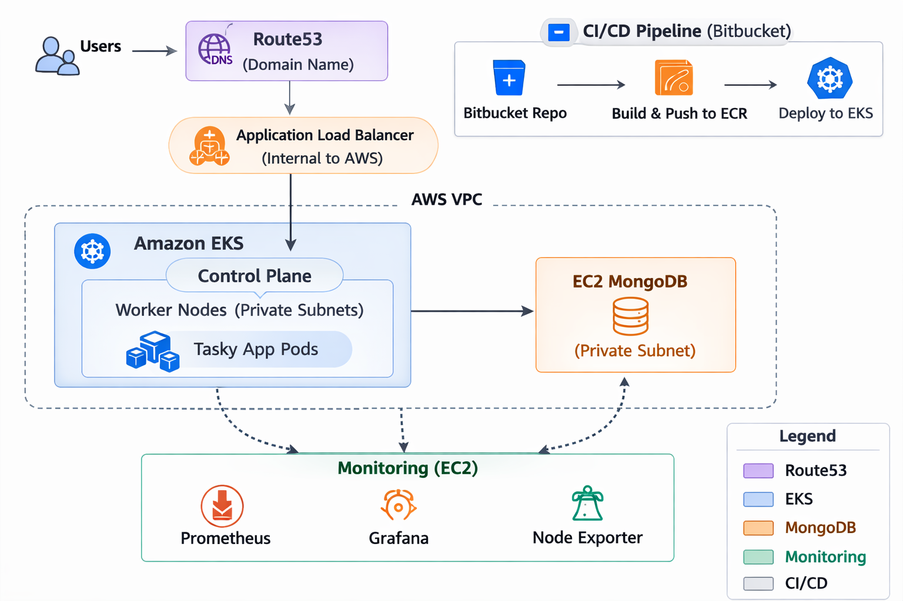

# Enterprise Architecture Overview

The Tasky platform is designed using cloud-native, enterprise-grade architecture principles to ensure scalability, security, reliability, and operational efficiency.

This solution follows modern DevOps and distributed system best practices aligned with AWS Well-Architected Framework pillars.

---

# Architectural Principles

The system is built on the following enterprise design principles:

- Infrastructure as Code (IaC)
- Immutable container deployments
- Least privilege access control
- Network isolation and segmentation
- Automated CI/CD delivery
- Horizontal scalability
- Observability and operational transparency

---

# High-Level System Architecture

The platform consists of five major layers:

1. Presentation Layer (User Access)
2. Load Balancing Layer
3. Container Orchestration Layer
4. Application Layer
5. Data Layer 

---

# Infrastructure as Code (terraform)

The application runs inside an Amazon VPC designed with:

- Public subnets (Monitoring-instance)
- Private subnets (Load Balancer, EKS worker nodes, Mongodb-instance)
- NAT Gateway for controlled outbound internet access
- Internet Gateway for public-facing components

Security groups enforce strict inbound and outbound traffic rules to minimize the attack surface.

All infrastructure components are provisioned using Terraform (Infrastructure as Code), ensuring repeatability and version control.

---

# Compute & Orchestration Layer (Amazon EKS)

The platform leverages Amazon Elastic Kubernetes Service (EKS) for container orchestration.

### Key Characteristics:

- Managed Kubernetes Control Plane
- Managed Node Group (Auto Scaling EC2 worker nodes)
- Horizontal scaling capability
- Rolling deployments with zero downtime
- Self-healing pods via Kubernetes controllers

The Managed Node Group ensures:

- High availability across multiple Availability Zones
- Controlled scaling via min, max, and desired capacity
- IAM-based instance permissions (least privilege model)

---

# Application Layer (Containerized Microservice)

The Tasky application is:

- Built using Go (Gin framework)
- Containerized using Docker
- Deployed as a Kubernetes Deployment
- Exposed via a Kubernetes LoadBalancer Service

Application configuration follows Twelve-Factor App principles:

- Environment-based configuration
- Secrets managed via Kubernetes Secrets
- Stateless application pods
- Externalized database dependency

---

# Data Layer (External MongoDB on EC2)

The MongoDB instance is deployed on a dedicated EC2 instance within a private subnet.

Enterprise security controls include:

- No public IP exposure
- Security group allowing access only from EKS worker nodes
- Port 27017 restricted to internal VPC CIDR
- Data persistence independent from application pods

This separation ensures:

- Clear boundary between compute and data
- Reduced blast radius in case of compromise
- Independent scalability strategy

---

# CI/CD & DevOps Automation

The delivery pipeline is implemented using Bitbucket CI/CD.

### Deployment Lifecycle:

1. Code are push to repository
2. Pipeline triggers automatically
3. Application build & validation
4. Docker image build
5. Vulnerability scanning (Trivy)
6. Image push to private Amazon ECR
7. Automated deployment to EKS

Benefits:

- Eliminates manual deployment risk
- Ensures consistent artifact promotion
- Enables rapid iteration
- Supports version-controlled deployments

---

# Security Architecture

Security is implemented across multiple layers:

### Identity & Access Management
- IAM roles for worker nodes
- Least privilege policy model
- No embedded credentials in source code

### Network Security
- Private subnets for compute and database
- Controlled inbound rules
- No open SSH to the internet
- Use of AWS security groups for segmentation

### Application Security
- Secrets stored in Kubernetes Secrets
- Image vulnerability scanning before deployment
- Private container registry (Amazon ECR)

### Operational Security
- Logs available via Kubernetes
- Rolling updates reduce downtime risk
- Self-healing workloads

---

# Scalability & High Availability

The system supports:

- Horizontal pod scaling
- Auto-scaling worker nodes
- Multi-AZ deployment
- Load-balanced traffic distribution

This ensures:

- Fault tolerance
- Elastic scaling under load
- Reduced single points of failure

---

# Reliability & Operational Excellence

The platform leverages Kubernetes-native capabilities:

- ReplicaSets for pod redundancy
- Rolling updates for zero downtime releases
- Health checks for application monitoring
- Declarative configuration management

This enables enterprise-grade operational stability.

---

# Enterprise Summary

The Tasky architecture demonstrates a production-ready, cloud-native deployment model that incorporates:

- Infrastructure as Code
- Secure containerized workloads
- Automated CI/CD pipeline
- Scalable Kubernetes orchestration
- Externalized and protected data layer
- Defense-in-depth security model

This design aligns with modern enterprise cloud architecture standards and is suitable for scalable production environments.

Author

**Adeola Oriade**

Email: Adeoladevops@gmail.com