# Production-Grade Infrastructure on AWS (EKS + EC2 Mongo + EC2 Monitoring + Bitbucket CI/CD)

---

# Project Overview

This project demonstrates a **complete production-style cloud infrastructure** built on AWS and deployed using DevOps best practices.

The system includes:
- AWS VPC with public and private subnets
- Amazon EKS cluster (Kubernetes)
- EC2-hosted MongoDB (external database)
- EC2-hosted Monitoring
- AWS ECR for container image storage
- Bitbucket CI/CD pipeline for automated deployments
- Kubernetes Secrets for secure configuration
- AWS LoadBalancer for public access

The objective is to simulate how real-world production systems are built, secured, and automated.

---

# High-Level Architecture

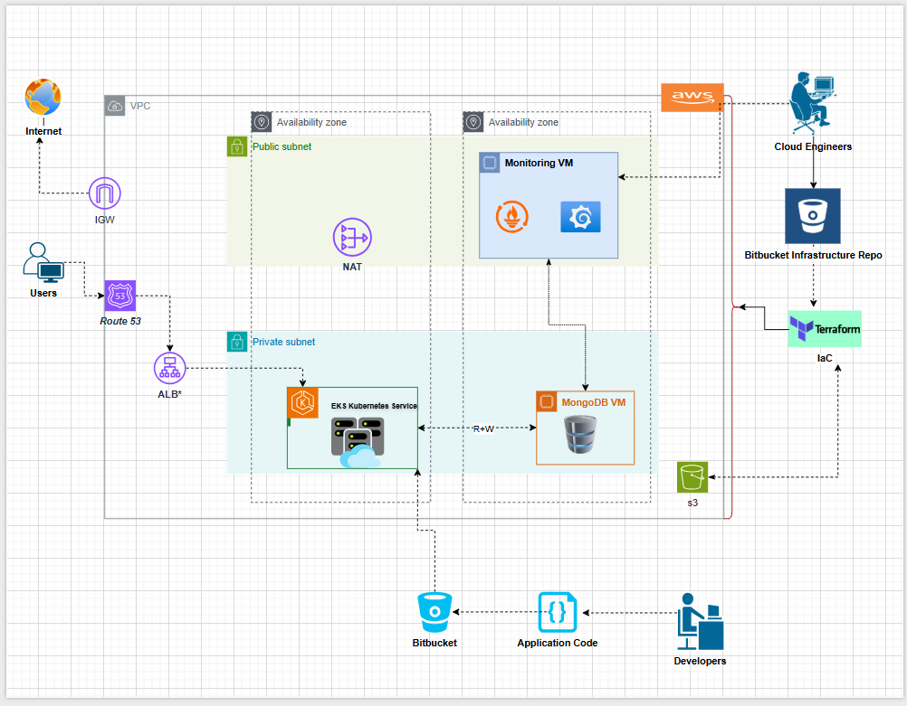

---

# Technology Stack

| Layer | Technology |
|-------|------------|
| Cloud Provider | AWS |
| Container Orchestration | Amazon EKS |
| Container Registry | Amazon ECR |
| CI/CD | Bitbucket Pipelines |
| Compute | EC2 (MongoDB) |
| Backend | Go (GIN framework) |
| Database | MongoDB |
| Networking | VPC, NAT Gateway, Security Groups |
| Secrets Management | Kubernetes Secrets |

---

# Networking Architecture

## VPC Configuration

- CIDR Block: `10.0.0.0/16`
- 2 Public Subnets (different AZs)
- 2 Private Subnets (different AZs)

### Public Subnets
Used for:
- NAT Gateway
- Monitoring EC2 (Prometheus & Grafana)

### Private Subnets
Used for:
- EKS Worker Nodes
- MongoDB EC2 (private)

---

## Internet Access Design

- Internet Gateway attached to VPC
- NAT Gateway created in public subnet
- Private subnets route outbound traffic via NAT
- Public subnets route to Internet Gateway

---

# IAM & Security

## IAM Roles

- EKS Cluster Role
  - Permissions:
    - AmazonEKSClusterPolicy

- Node Group Role
  - Permissions:
    - AmazonEKSWorkerNodePolicy
    - AmazonEKS_CNI_Policy
    - AmazonEC2ContainerRegistryReadOnly

- cluster_autoscaler
  - Permissions:
    - autoscaling:DescribeAutoScalingGroups
    - autoscaling:DescribeAutoScalingInstances
    - autoscaling:SetDesiredCapacity
    - autoscaling:TerminateInstanceInAutoScalingGroup
    - ec2:DescribeInstanceTypes
    - eks:DescribeNodegroup

- SSM
  - Permissions:
    - AmazonSSMManagedInstanceCore

## Security Groups

### Monitoring instance (Public subnet)
- Allow SSH Port (22)
- Allow HTTP Port (80)
- Allow Prometheus Port (9090)
- Allow Node_Exporter Port (9100)
- Allow Grafana Port (3000)

### MongoDB instance (Private subnet)
- Allow inbound Port (27017) from VPC_CIDR
- Allow Node_Exporter Port (9100)
- Allow MongoDB_Node_Exporter port (9216)

### EKS Nodes
- Allow inbound from LoadBalancer
- Allow outbound to MongoDB

### Managed Node Group (Worker Nodes)
- Allow traffic from EKS control plane security group
- Allow required database access (e.g., MongoDB 27017)
- Allow application-specific ports internally
- No public SSH access
- Allow HTTPS (443) for AWS API communication

---
---

# Kubernetes (Amazon EKS)

## EKS Cluster

- Cluster Configuration
- Managed control plane
- Worker nodes in private subnets
- IAM roles attached to Cluster
- IAM roles attached to node group
- VPC CNI for pod networking

---
---

## MongoDB Instance Infrastructure
- MongoDB runs on a separate EC2 instance.
- Allow SSM
- EC2 Configuration
- installed Node_Exporter
- Installed MongoDB_Exporter
- Installed MongoDB manually
  - Configured bindIp: 0.0.0.0
  - Port: 27017

## Monitoring Instance Infrastructure
- MongoDB runs on a separate EC2 instance.
- EC2 Configuration
- Installed Grafana
- Installed Node_Exporter
- Installed Prometheus

---
---

# Infrastructure Deployment & Verification Guide

## Required Bitbucket Variables

```AWS
AWS_ACCESS_KEY_ID
AWS_SECRET_ACCESS_KEY
AWS_REGION
TF_VAR_AWS_S3_BUCKET
TF_VAR_AWS_S3_BUCKET_KEY
SSH_PUBLIC_KEY
project_name
ami
volume_size
instance_type

```
## Initialize and Deploy Infrastructure

```BASH
terraform init
terraform plan
terraform fmt
terraform apply -auto-approve
```

**Terraform will provision all resources.**

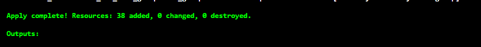

---

## Verify EKS Cluster

### Check EKS Cluster Status
```BASH
aws eks describe-cluster \
  --name <your-cluster-name> \
  --region <your-region> \
  --query "cluster.status"
  ```

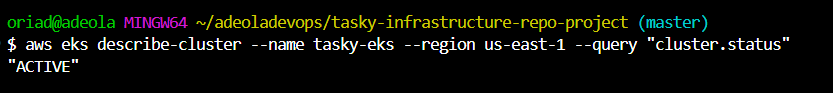

### Configure kubectl Access
```
aws eks update-kubeconfig \
  --name <your-cluster-name> \
  --region <your-region>
```

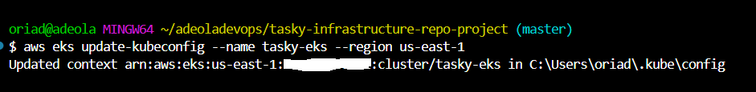

### Confirm Cluster Connectivity
```BASH
kubectl get nodes
kubectl get namespaces
```

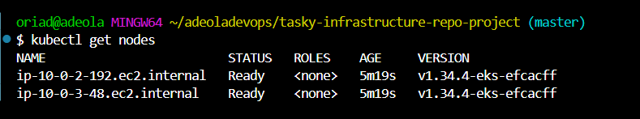

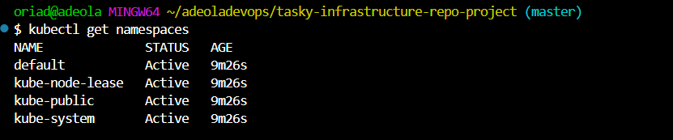

### Test: Deploy a Dummy App (OPTIONAL) 
```BASH
kubectl create namespace test 
kubectl run hello-nginx --image=nginx --port=80 -n test 
kubectl expose pod hello-nginx --type=LoadBalancer --name=hello-service -n test 
kubectl get svc -n test 

Get Service External IP
  kubectl get svc -n test
```

---

## Connect to EC2 via AWS SSM

### Verify Instance Appears in SSM
```BASH
aws ssm describe-instance-information
```

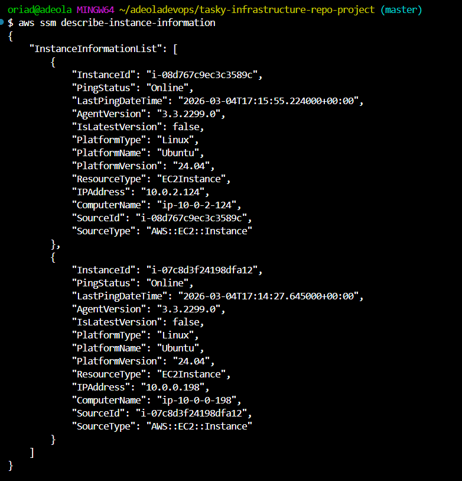

### Start SSM Session
```BASH
aws ssm start-session --target <instance-ID>
```

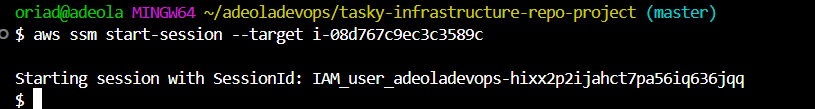

### Check If User Data Executed Completely 

```BASH
sudo cloud-init status 
```

### To force re-run user_data without rebuilding instance: 

```BASH
sudo cloud-init clean 
sudo cloud-init init 
Then reboot 
   Sudo reboot 
```

#### Verify MongoDB is Running
```BASH
sudo systemctl status mongod
```

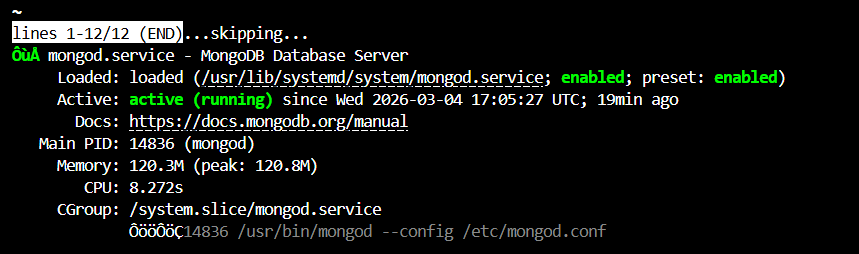

---

#### Verify MongoDB_exporter is Running
```BASH
sudo systemctl status mongodb_exporter
```

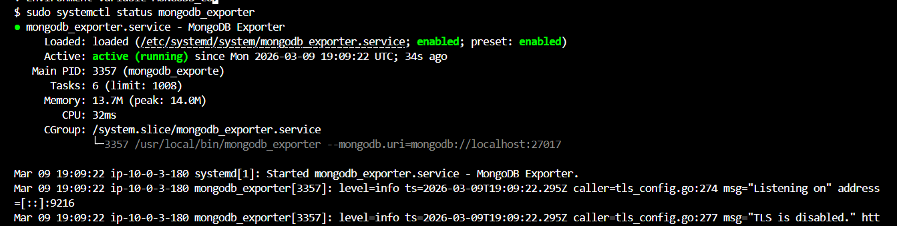

---

#### Verify node_exporter is Running
```BASH
sudo systemctl status node_exporter
```

---

## Monitoring instance checks

### Verify Monitoring Instance
```BASH
SSH into Monitoring instance
  ssh -i <KEY_PAIR> ubuntu@<INSTANCE_IP>
sudo systemctl status prometheus
sudo systemctl status grafana-server
sudo systemctl status node_exporter
```

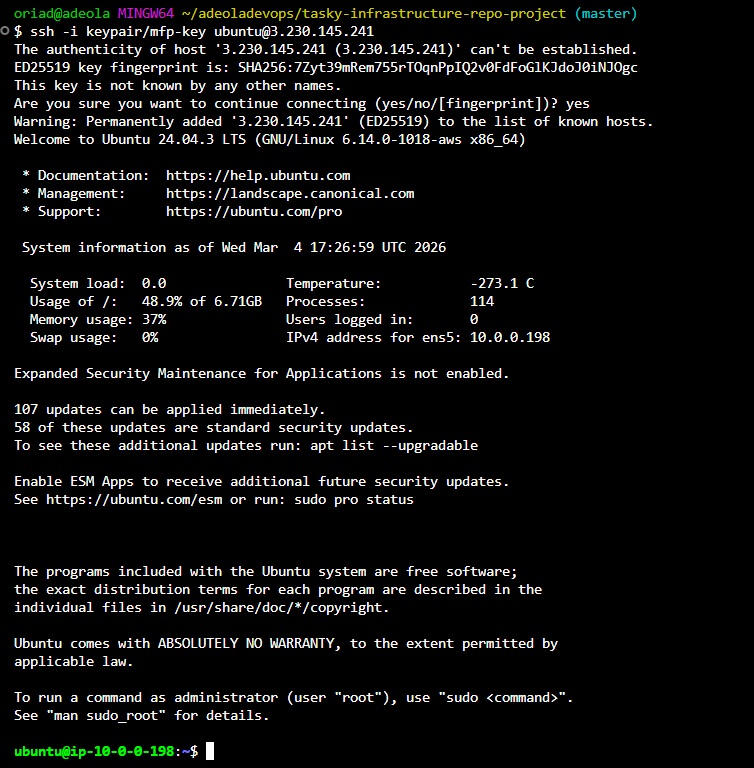

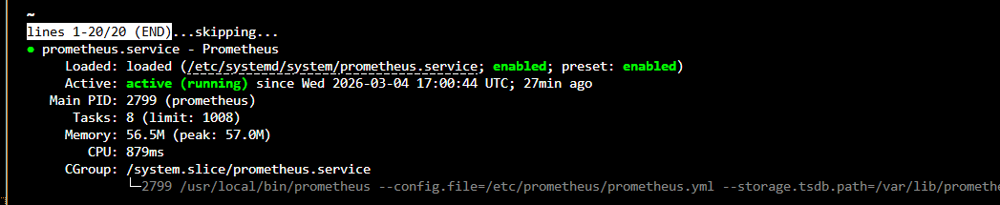

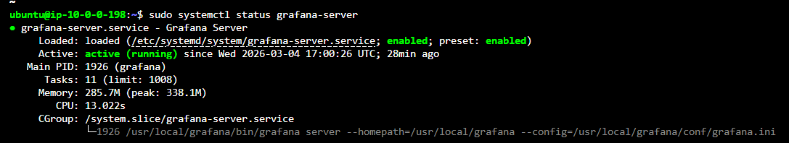

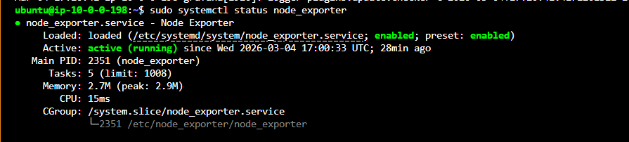

---
---

# Final Outcome

After completing all steps, you should have:
- Functional EKS Cluster
- Running Worker Nodes
- Secure EC2 access via SSM
- Running MongoDB instance
- Monitoring stack operational

---
---

# CI/CD Pipeline (Bitbucket)

### After confirming the application works locally, proceed with deployment using the CI/CD pipeline.

**Note:** The Bitbucket pipeline configuration used for deployment can be found in **bitbucket-pipelines.yml**.

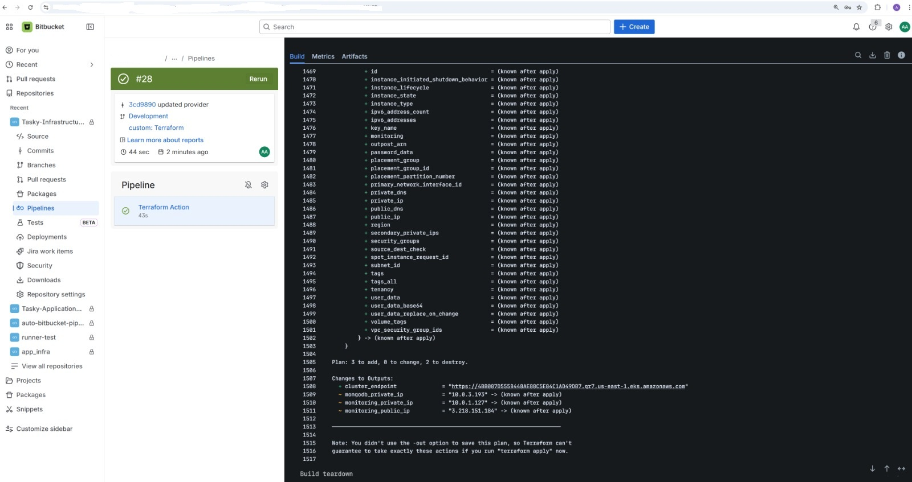

---

## Project Supervision

This project was completed under the supervision of:

**Name:** Timothy Eleazu  
**Email:** timeleazudevops@gmail.com  

The supervisor provided guidance, reviewed progress, and assessed the final deployment and presentation.


## Student name

**Name** Adeola Oriade

**Email:** adeoladevops@gmail.com 

### This repository is part of my ongoing effort to document my cloud journey and share what I learn publicly.